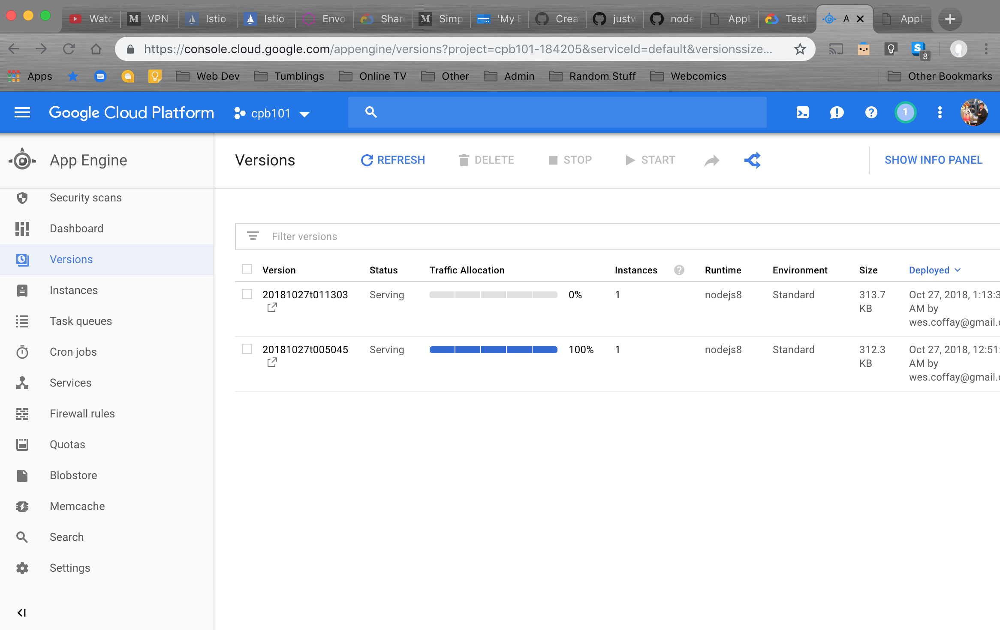
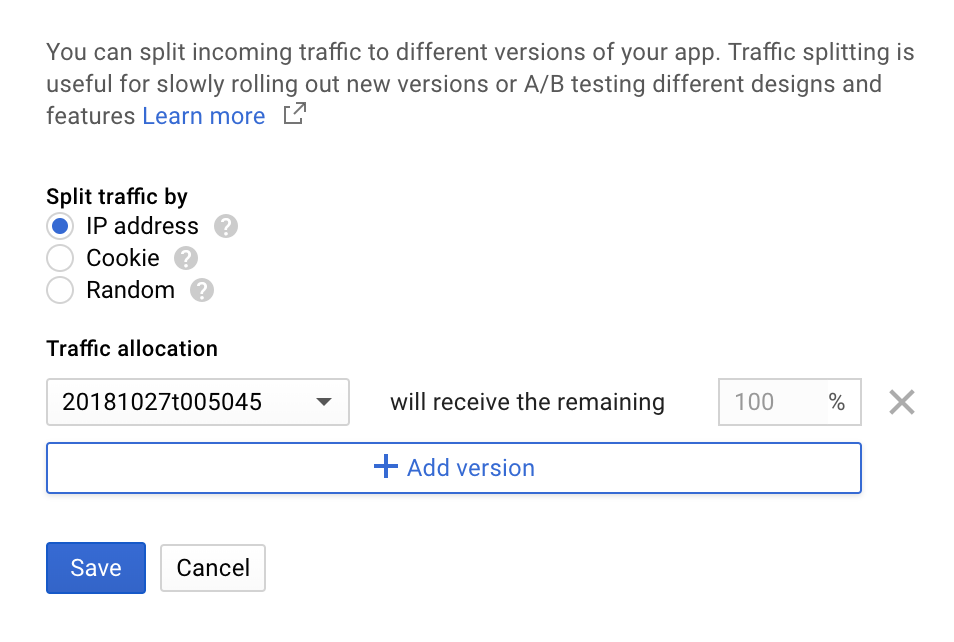
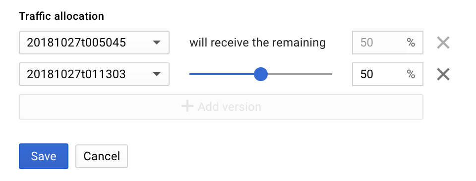
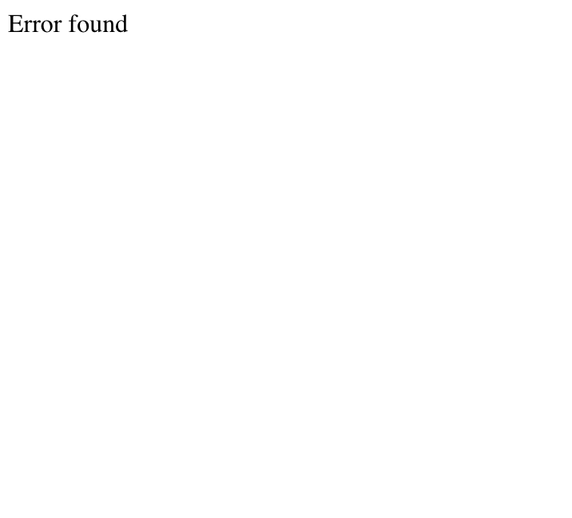

Context:
--
Cloud Architect Exam Candidates can expect several questions on deploying, updating, managing, debugging, and rolling back App Engine resources. Completing these steps end to end will provide hands on experience with this platform.


Scope
--
Create an App Engine deployment using this GitHub repo: <coming soon>.
Deploy the V1 branch of the app into production.
Update the app to the V2 branch code.
Under the Versions pane, set up a canary deployment by splitting traffic to 80%/20% for versions 1 and 2 respectively.
Rollback the app to V1.

The solution should include the following GCP services:

- Google Compute Engine

Steps
--
#### Part 1

1. Open CloudShell in the GCP console.

2. Run `git clone https://github.com/keepitsts/GcpCaCertProject3.git` to clone this repo with the source code to your cloudshell instance.

3. Make sure to `cd GcpCaCertProject3` to navigate to the correct directory.

4. Take a look at the files in the app:
```
app.js  
app.yaml  
index.html  
package.json  
package-lock.json  
README.md
```

5. Let's test out the app and see how it works! Run `npm install` to install all the dependencies. Then, run `npm start` to start a dev server in your cloudshell. You should see the following:
```
App listening on port 8080
Press Ctrl+C to quit.
```

6. In the upper right corner of the cloudshell window, select the web preview button (immediately to the left of the three vertical dots). Choose to preview on port 8080, this will open a new browser window where you can see the app. If everything looks good, let move forward and deploy this with the App Engine.

7. In your cloudshell terminal, press `ctrl` and `c` to shut down the development server.

8. Run the command `npm run deploy`. Gcloud will generate a list of services to be generated. You will be asked `Do you want to continue (Y/n)?`. Enter `y` to continue.

9. Run `gcloud app browse` and the terminal will generate a url. It will look like this: `https://<project-id>.appspot.com`. Go to the link, and you should see the application.

#### Part 2
Now that our app is deployed, lets introduce some trouble.

1. There's a new version of our app! Lets switch to it by running `git checkout v2` in our cloudshell. Feel free to poke around, see if you can see what's changed.

2. We want to deploy the new version, but we don't want to overwrite our v1, which has been working wonderfully. We can do this by running `gcloud app deploy --no-promote`. Confirm that you want to deploy this. Once the deployment runs, you can see that the url our app is hosted at is still serving v1 of our app.

3. This next part, we will use the console to complete. Navigate to the App Engine console, you can see both versions of our app:



4. Currently, 100% of traffic is going to v1. Let's change that, shall we? In the options menu, select the split traffic icon:


5. In this panel, select `+ Add version`



6. Since there's only one other version, it will autopopulate with v2. Drag the percent split to 50 for v2 (this is more of a blue/green than a canary deployment, but this better illustrates the issue with the app):



NB: Make sure you change the `Split traffic by option` from IP address like it is in the screenshot to Random. In most cases, having sticky sessions, especially with a no-ops cookie, would be awesome, but we want to see both versions of the app in quick succession.

7. Go back to your app url and refresh the page a few times. After a handful of refreshes, you should get an error like this:



8. Bad developers! This is why a robust suite of tests is an important part of any deployment process. Fortunately, you can easily roll back 100% of your traffic to v1- the stable build, while your developers go think about what they did.  
